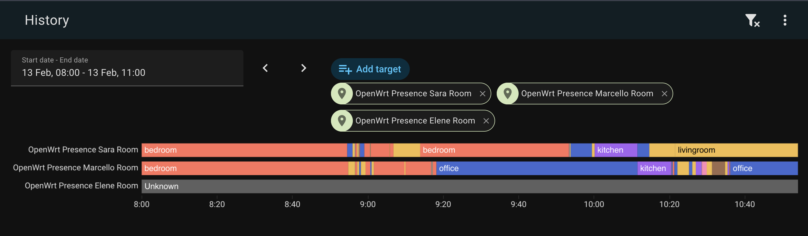
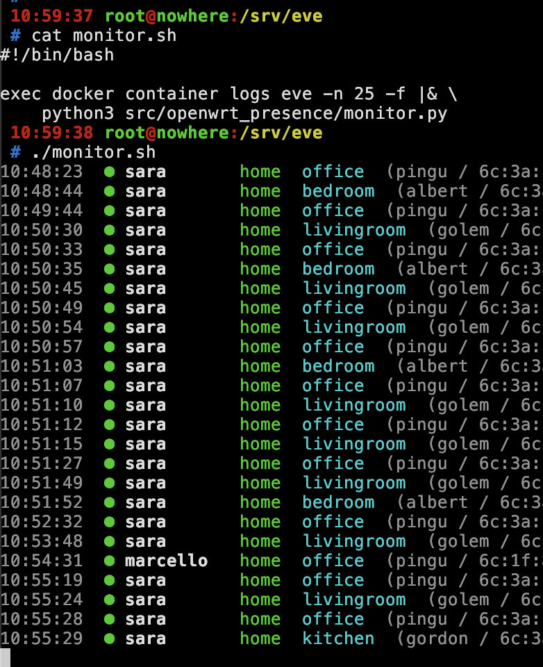

# openwrt-presence

WiFi-based presence detection for Home Assistant using OpenWrt APs.

Scrapes RSSI metrics (`wifi_station_signal_dbm`) directly from each AP's `/metrics` endpoint and publishes per-person home/away state and room location to Home Assistant via MQTT. No cloud, no Bluetooth beacons, no phone polling, no TSDB — just your existing WiFi infrastructure doing what it already knows: which devices are connected and where.

Room detection uses signal strength — your phone is in whichever room has the strongest RSSI reading. Departure detection uses metric disappearance — if a MAC vanishes from all APs for longer than the departure timeout, the person is away.



## 🧠 How it works

```
OpenWrt APs  -->  openwrt-presence  -->  MQTT  -->  Home Assistant
 (node-exporter-lua)  (state machine)      (discovery)   (device_tracker + sensor)
```

Every ~5 seconds, `openwrt-presence` scrapes the `/metrics` endpoint on each AP for current RSSI readings of tracked MAC addresses. The engine processes each snapshot:

1. **Visible devices** → marked CONNECTED, room set by strongest RSSI
2. **Disappeared devices** → marked DEPARTING, departure timer starts
3. **Timer expires** (default 120s) → marked AWAY
4. **Reappears** → timer cancelled, back to CONNECTED

All APs are equal — no exit/interior distinction needed. The RSSI metrics tell the full story.

### 🏠 HA entities created

For each person in the config:

- `device_tracker.<person>_wifi` — `home` / `not_home` (source type: `router`)
- `sensor.<person>_room` — current room name (e.g. `office`, `bedroom`)

## 🚀 Quick start

1. Copy the example files and edit them:

```bash
cp config.yaml.example config.yaml
cp Dockerfile.example Dockerfile
cp docker-compose.yaml.example docker-compose.yaml
# Edit config.yaml with your APs, people, and MAC addresses
```

2. Run with Docker Compose:

```bash
docker compose up -d
```

Or run directly:

```bash
pip install .
python -m openwrt_presence
```

### Environment variables

| Variable | Default | Description |
|----------|---------|-------------|
| `CONFIG_PATH` | `config.yaml` | Path to config file |

The `.example` files are tracked by git; `config.yaml`, `Dockerfile`, and `docker-compose.yaml` are gitignored so you can customise them without dirtying the repo.

## ⚙️ Configuration

See [`config.yaml.example`](config.yaml.example) for a full example.

### 📡 Nodes

Each node maps an AP hostname to a room name. The hostname is used to construct the scrape URL: `http://<hostname>:<exporter_port>/metrics`.

```yaml
nodes:
  ap-garden:
    room: garden
  ap-office:
    room: office
  ap-bedroom:
    room: bedroom
    url: http://192.168.1.50:9100/metrics   # override if no DNS or custom port
```

Use the `url` override if an AP doesn't have local DNS or uses a non-standard port.

### ⏱️ Departure timeout

`departure_timeout` (seconds) is how long a device can be absent from all APs before the person is marked away. Default: `120`. This covers brief WiFi dropouts, phone doze cycles, and AP roaming transitions.

### 📡 Exporter port

`exporter_port` (default `9100`) is the port used to construct scrape URLs from AP hostnames. Can be overridden per-node with the `url` field.

## 🏡 Home Assistant integration

### Prerequisites

The [MQTT integration](https://www.home-assistant.io/integrations/mqtt/) must be configured in HA with your Mosquitto broker. Entities are auto-discovered via MQTT Discovery — no manual HA configuration needed.

### 📱 Interaction with HA Companion App

HA's `person` entity prioritises non-GPS (router) trackers when they say `home`, but falls through to GPS when they say `not_home`. If GPS is stale, the person entity may stay `home` even after WiFi says `not_home`.

For automations that need fast departure detection (e.g. alarm arming), reference `device_tracker.<person>_wifi` directly instead of the `person` entity.

For people without the companion app (e.g. a housekeeper), `device_tracker.<person>_wifi` is the sole presence source.

### 🧩 Example: template sensor combining WiFi + GPS

```yaml
template:
  - binary_sensor:
      - name: "Alice Home"
        state: >
          {{ is_state('device_tracker.alice_wifi', 'home')
             or is_state('person.alice', 'home') }}
```

### 🔐 Example: arm alarm when everyone leaves

```yaml
automation:
  - alias: "Arm alarm when everyone leaves"
    trigger:
      - platform: state
        entity_id:
          - device_tracker.alice_wifi
          - device_tracker.bob_wifi
        to: "not_home"
    condition:
      - condition: state
        entity_id: device_tracker.alice_wifi
        state: "not_home"
      - condition: state
        entity_id: device_tracker.bob_wifi
        state: "not_home"
    action:
      - service: alarm_control_panel.alarm_arm_away
        target:
          entity_id: alarm_control_panel.home_alarm
```

## 📡 OpenWrt prerequisites

### RSSI metrics exporter

Each AP needs [`prometheus-node-exporter-lua`](https://openwrt.org/docs/guide-user/perf_and_log/statistic.custom#prometheus_metrics) with the `wifi_stations` collector enabled. This exposes `wifi_station_signal_dbm` per associated station.

Install on OpenWrt:

```bash
opkg update
opkg install prometheus-node-exporter-lua prometheus-node-exporter-lua-wifi_stations
/etc/init.d/prometheus-node-exporter-lua restart
```

`openwrt-presence` scrapes each AP directly — no metrics collector or TSDB needed.

## 🔧 Development

```bash
python3 -m venv .venv
source .venv/bin/activate
pip install -e ".[dev]"
pytest -v
```

### 📺 Log monitor

A pretty-print CLI is included for watching the log stream in real time with ANSI colors — green for arrivals, red for departures, room names, RSSI values, device details:

```bash
docker container logs <container> -f 2>&1 | python3 src/openwrt_presence/monitor.py
```

Replace `<container>` with your actual container name or ID.



## 📄 License

[MIT](LICENSE)
